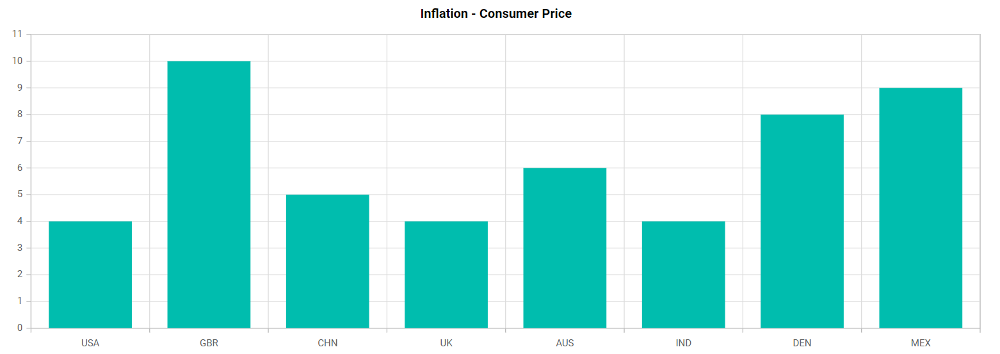

# How-to-bind-array-collection-in-Blazor-chart

This article explains how to bind a array collection in Blazor Chart Component.

**Binding array collection in Blazor chart**

[Blazor Chart](https://www.syncfusion.com/blazor-components/blazor-charts) provide the support to bind the value from a array collection to the data points. We need to take the value from the array using the index and then the returned value is bound.

The below code example shows how to bind array collection in the Blazor chart.

**Index.razor**

```cshtml

@using Syncfusion.Blazor.Charts

<SfChart  Title="Inflation - Consumer Price">

    <ChartPrimaryXAxis ValueType="Syncfusion.Blazor.Charts.ValueType.Category">
        </ChartPrimaryXAxis>
    <ChartSeriesCollection>
        <ChartSeries DataSource="@ConsumerDetails" XName="X" YName="YValue" Type="ChartSeriesType.Column"></ChartSeries>
    </ChartSeriesCollection>

</SfChart>

@code {    

    public class ChartData
    {   
        public string X { get; set; }        
        public double[] Y { get; set; }
        public double YValue { get { return Y[0] ; } }

    }

    public List<ChartData> ConsumerDetails = new List<ChartData>    
    {
        new ChartData { X= "USA",  Y = new double[]{4,10} },
        new ChartData { X= "GBR",  Y = new double[]{10,10} },
        new ChartData { X= "CHN",  Y = new double[]{5,10} },
        new ChartData { X= "UK",   Y = new double[]{4,10} },
        new ChartData { X= "AUS",  Y = new double[]{6,10} },
        new ChartData { X= "IND",  Y = new double[]{4,10} },
        new ChartData { X= "DEN",  Y = new double[]{8,10} },
        new ChartData { X= "MEX",  Y = new double[]{9,10} }
    };    
}

```

The following screenshot illustrate the output of the above code snippet.

**Output:**



**Conclusion**

I hope you enjoyed learning how to bind value from array collection in Blazor Chart Component.

You can refer to our [Blazor Chart feature tour](https://www.syncfusion.com/blazor-components/blazor-charts) page to know about its other groundbreaking feature representations and [documentation](https://blazor.syncfusion.com/documentation/chart/getting-started), and how to quickly get started for configuration specifications. You can also explore our [Blazor Chart example](https://blazor.syncfusion.com/demos/chart/line?theme=bootstrap5) to understand how to create and manipulate data.

For current customers, you can check out our components from the [License and Downloads](https://www.syncfusion.com/sales/teamlicense) page. If you are new to Syncfusion, you can try our 30-day [free trial](https://www.syncfusion.com/downloads/blazor) to check out our other controls.

If you have any queries or require clarifications, please let us know in the comments section below. You can also contact us through our [support forums](https://www.syncfusion.com/forums), [support portal](https://support.syncfusion.com/create), or [feedback portal](https://www.syncfusion.com/feedback/blazor-components?control=charts). We are always happy to assist you!